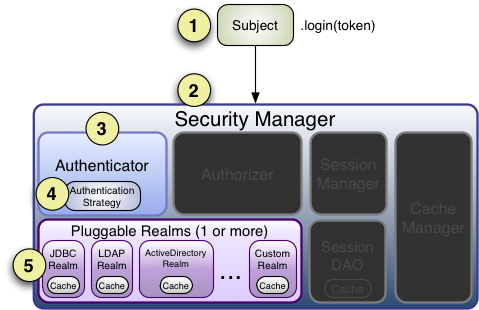

# 5. Authentication 认证

认证（Authentication）：身份验证的过程--也就是证明一个用户的真实身份。为了证明用户身份，需要提供系统理解和相信的身份信息和证据。

需要通过向 Shiro 提供用户的身份（principals）和证明（credentials ）来判定是否和系统所要求的匹配。

* **Principals(身份)** 是Subject的“标识属性”，可以是任何与Subject相关的标识，比如说名称（给定名称）、名字（姓或者昵称）、用户名、安全号码等等，当然像昵称这样的内容不能很好的对Subject进行独特标识，所以最好的身份信息（Principals）是使用在程序中唯一的标识--典型的使用用户名或邮件地址。
  * **Primary Principal(最主要的身份)**虽然 Shiro 可以使用任何数量的身份，Shiro 还是希望一个程序精确地使用一个主要的身份--一个仅有的唯一标识 Subject 值。在多数程序中经常会是一个用户名、邮件地址或者全局唯一的用户 ID。
* **Credentials(证明)** 通常是只有 Subject 知道的机密内容，用来证明他们真正拥有所需的身份，一些简单的证书例子如密码、指纹、眼底扫描和X.509证书等。

最常见的身份/证明是用户名和密码，用户名是所需的身份说明，密码是证明身份的证据。如果一个提交的密码和系统要求的一致，程序就认为该用户身份正确，因为其他人不应该知道同样的密码。

## 验证Subject

Subject 验证的过程可以有效地划分分以下三个步骤：

1. 收集 Subject 提交的身份和证明；
2. 向 Authentication 提交身份和证明；
3. 如果提交的内容正确，允许访问，否则重新尝试验证或阻止访问

下面的代码示范了 Shiro API 如何实现这些步骤：

### 第一步：收集用户身份和证明

	//最常用的情况是 username/password 对:
	UsernamePasswordToken token = new UsernamePasswordToken(username, password);
	
	//”Remember Me” 功能是内建的
	token.setRememberMe(true);

在这里我们使用 [UsernamePasswordToken](http://shiro.apache.org/static/current/apidocs/org/apache/shiro/authc/UsernamePasswordToken.html)，支持所有常用的用户名/密码验证途径，这是一个 [org.apache.shiro.authc.AuthenticationToken](http://shiro.apache.org/static/current/apidocs/org/apache/shiro/authc/AuthenticationToken.html) 接口的实现，这个接口被 Shiro 认证系统用来提交身份和证明。

注意 Shiro 并不关心你如何获取这些信息：也许是用户从一个HTML表单中提交的，或者可能从一个 HTTP 请求字串中解析的，也可能来自于Swing或者 Flex GUI 的密码表单，或者通过命令行参数得到。从程序终端用户获取信息的过程与 Shiro 的 AuthenticationToken 完全无关。

你可以随自己喜欢构造和引用 AuthenticationToken 实例 -- 这是协议无关的。

这个例子同样显示我们希望 Shiro 在尝试验证时执行 “Remember Me” 服务，这确保 Shiro 在用户今后返回系统时能记住他们的身份，我们会在以后的章节讨论 [“Remember Me”](https://cwiki.apache.org/confluence/pages/createpage.action?spaceKey=SHIRO&title=Remember+Me&linkCreation=true&fromPageId=25203054) 服务。

### 第二步：提交身份和证明

当身份和证明住处被收集并实例化为一个 AuthenticationToken （认证令牌）后，我们需要向 Shiro 提交令牌以执行真正的验证尝试：

	Subject currentUser = SecurityUtils.getSubject();
	
	currentUser.login(token);

在获取当前执行的 Subject 后，我们执行一个单独的 [login](http://shiro.apache.org/static/current/apidocs/org/apache/shiro/subject/Subject.html#login(org.apache.shiro.authc.AuthenticationToken)) 命令，将之前创建的 AuthenticationToken 实例传给它。

调用 login 方法将有效地执行身份验证。

### 第三步：处理成功或失败

当login函数没有返回信息时表明验证通过了。程序可以继续运行，此时执行 SecurityUtils.getSubject() 将返回验证后的 Subject 实例，subject.[isAuthenticated()](http://shiro.apache.org/static/current/apidocs/org/apache/shiro/subject/Subject.html#isAuthenticated()) 将返回true。

但是如果 login 失败了呢？例如，用户提供了一个错误的密码或者因访问系统次数过多而被锁定将会怎样呢？

Shiro拥有丰富的运行期异常[AuthenticationException](http://shiro.apache.org/static/current/apidocs/org/apache/shiro/authz/AuthorizationException.html)可以精确标明为何验证失败，你可以将 login 放入到 try/catch 块中并捕获所有你想捕获的异常并对它们做出处理。例如：

	try {
	    currentUser.login(token);
	} catch ( UnknownAccountException uae ) { ...
	} catch ( IncorrectCredentialsException ice ) { ...
	} catch ( LockedAccountException lae ) { ...
	} catch ( ExcessiveAttemptsException eae ) { ...
	} ... 捕获你自己的异常 ...
	} catch ( AuthenticationException ae ) {
	    //未预计的错误?
	}
	
	//没问题，继续

如果原有的异常不能满足你的需求，可以创建自定义的AuthenticationExceptions 来表示特定的失败场景。

*登录失败小贴士*

*虽然你的代码可以对指定的异常做出处理并执行某些所需的逻辑，但有经验的安全做法是仅向终端用户输出一般的失败信息，例如“错误的用户名和密码”。这确保不向尝试攻击你的黑客提供有用的信息。*

## Remembered vs. Authenticated
 
如上例所示，Shiro 支持在登录过程中执行"remember me"，在此值得指出，一个已记住的 Subject（remembered Subject）和一个正常通过认证的 Subject（authenticated Subject）在 Shiro 是完全不同的。 

* **记住的（Remembered）**：一个被记住的 Subject 不会是匿名的，拥有一个已知的身份（也就是说subject.[getPrincipals()](http://shiro.apache.org/static/current/apidocs/org/apache/shiro/subject/Subject.html#getPrincipals())返回非空）。它的身份被先前的认证过程所记住，并存于先前session中，一个被认为记住的对象在执行subject.[isRemembered()](http://shiro.apache.org/static/current/apidocs/org/apache/shiro/subject/Subject.html#isRemembered())返回true。
* **已验证（Authenticated）**：一个被验证的 Subject 是成功验证后（如登录成功）并存于当前 session 中，一个被认为验证过的对象调用subject.[isAuthenticated()](http://shiro.apache.org/static/current/apidocs/org/apache/shiro/subject/Subject.html#isAuthenticated()) 将返回true。

*互斥的*

*已记住（Remembered）和已验证（Authenticated）是互斥的--一个标识值为真另一个就为假，反过来也一样。*

### 为什么区分？

验证（authentication）有明显的证明含义，也就是说，需要担保Subject 已经被证明他们是谁。

当一个用户仅仅在上一次与程序交互时被记住，证明的状态已经不存在了：被记住的身份只是给系统一个信息这个用户可能是谁，但不确定，没有办法担保这个被记住的 Subject 是所要求的用户，一旦这个 Subject 被验证通过，他们将不再被认为是记住的因为他们的身份已经被验证并存于当前的session中。

所以尽管程序大部分情况下仍可以针对记住的身份执行用户特定的逻辑，比如说自定义的视图，但不要执行敏感的操作直到用户成功执行身份验证使其身份得到确定。

例如，检查一个 Subject 是否可以访问金融信息应该取决于是否被验证（isAuthenticated()）而不是被记住（isRemembered()），要确保该Subject 是所需的和通过身份验证的。

### 一个例子说明

下面是一个非常常见的场景帮助说明被记住和被验证之间差别为何重要。 

假设你使用[Amazon.com](http://www.amazon.com/)，你已经成功登录并且在购物篮中添加了一些书籍，但你由于临时要参加一个会议，匆忙中你忘记退出登录，当会议结束，回家的时间到了，于是你离开了办公室。

第二天当你回到工作，你意识到你没有完成你的购买动作，于是你回到Amazon.com，这时，Amazon.com“记得”是是，通过你的名字向你打招呼，仍旧给你提供个性化的图书推荐，对于Amazon.com，subject.isRemembered() 将返回真。

但是当你想访问你帐号的信用卡信息完成图书购买的时候会怎样呢？虽然Amazon.com “记住”了你（isRemembered() == true），它不能担保你就是你（也许是正在使用你计算机的同事）。

于是，在你执行像使用信用卡信息之类的敏感操作之前，Amazon.com 强制你登录以使他们担保你的身份，在你登录之后，你的身份已经被验证，对于Amazon.com，isAuthenticated()将返回真。

这类情景经常发生，所以 Shiro 加入了该功能，你可以在你的程序中使用。现在是使用 isRemembered() 还是使用 isAuthenticated() 来定制你的视图和工作流完全取决于你自己，但 Shiro 维护这种状态基础以防你可能会需要。

## 退出登录

与验证相对的是释放所有已知的身份信息，当 Subject 与程序不再交互了，你可以调用 subject.logout() 丢掉所有身份信息。

	currentUser.logout(); //清除验证信息，使 session 失效

当你调用 logout，任何现存的 session 将变为不可用并且所有的身份信息将消失（如：在 web 程序中，RememberMe 的 Cookie 信息同样被删除）。

当一个 Subject 退出登录，Subject 被重新认定为匿名的，对于 web 程序，如果需要可以重新登录。

*Web 程序需注意*

*因为在 Web 程序中记住身份信息往往使用 Cookies，而 Cookies 只能在 Response 提交时才能被删除，所以强烈要求在为最终用户调用subject.logout() 之后立即将用户引导到一个新页面，确保任何与安全相关的 Cookies 如期删除，这是 Http 本身 Cookies 功能的限制而不是 Shiro 的限制。*

## 认证序列

直到现在，我们只看到如何在程序代码中验证一个 Suject，现在我们看一下当一个验证发生时 Shiro 内部发生了什么。

我们仍使用之前在架构[Architecture](../I. Overview 总览/3. Architecture 架构.md)章节里见到过的架构图，仅将左侧跟认证相关的组件高亮，每一个数字代表认证中的一个步骤：

 

**第1步**：程序代码调用 Subject.login 方法，向AuthenticationToken（认证令牌）实例的构造函数传递用户的身份和证明。

**第2步**：Subject 实例，通常是一个 [DelegatingSubject](http://shiro.apache.org/static/current/apidocs/org/apache/shiro/subject/support/DelegatingSubject.html)（或其子类）通过调用 securityManager.login(token )将这个令牌转交给程序的 SecurityManager。

**第3步**：SecurityManager，基本的“安全伞”组件，得到令牌并通过调用 authenticator.[authenticate(token)](http://shiro.apache.org/static/current/apidocs/org/apache/shiro/authc/Authenticator.html#authenticate(org.apache.shiro.authc.AuthenticationToken))简单地将其转交它内部的 [Authenticator](http://shiro.apache.org/static/current/apidocs/org/apache/shiro/authc/Authenticator.html)  实例，大部分情况下是一个 [ModularRealmAuthenticator](http://shiro.apache.org/static/current/apidocs/org/apache/shiro/authc/pam/ModularRealmAuthenticator.html) 实例，用来支持在验证过程中协调一个或多个Realm实例。ModularRealmAuthenticator 本质上为 Apache Shiro（在 PAM 术语中每一个 Realm 称为一个“模块”）提供一个 [PAM](http://en.wikipedia.org/wiki/Pluggable_Authentication_Modules) 类型的范例。

**第4步**：如程序配置了多个 Realm，ModularRealmAuthenticator实例将使用其配置的 [AuthenticationStrategy](http://shiro.apache.org/static/current/apidocs/org/apache/shiro/authc/pam/AuthenticationStrategy.html) 开始一个 多 Realm 身份验证的尝试。在 Realm 被验证调用的整个过程中，AuthenticationStrategy（安全策略）被调用用来回应每个Realm结果，我们将稍后讨论 AuthenticationStrategies。

*注意：单 Realm 程序*

*如果仅有一个 Realm 被配置，它直接被调用--在单 Realm 程序中不需要AuthenticationStrategy。*

**第5步**：每一个配置的 Realm 都被检验看其是否[支持](http://shiro.apache.org/static/current/apidocs/org/apache/shiro/realm/Realm.html#supports(org.apache.shiro.authc.AuthenticationToken))提交的AuthenticationToken，如果支持，则该 Realm 的 [getAuthenticationInfo](http://shiro.apache.org/static/current/apidocs/org/apache/shiro/realm/Realm.html#getAuthenticationInfo(org.apache.shiro.authc.AuthenticationToken)) 方法随着提交的牌被调用，getAuthenticationInfo 方法为特定的 Realm 有效提供一次独立的验证尝试，我们将稍后讨论 Realm 验证行为。

### Authenticator

就像以前提到过的，Shiro SecurityManager implementations默认使用一个 [ModularRealmAuthenticator](http://shiro.apache.org/static/current/apidocs/org/apache/shiro/authc/pam/ModularRealmAuthenticator.html) 实例， ModularRealmAuthenticator 同样支持单 Realm 和多 Realm。

在一个单 Realm 程序中，ModularRealmAuthenticator 将直接执行单独的 Realm，如果配置有两个或以上 Realm，将会使用AuthenticationStrategy 实例来协调如何进行验证，我们将在下面的章节中讨论 AuthenticationStrategy。

如果你希望用自定义的 Authenticator 实现配置 SecurityManager，你可以在 shiro.ini 中做这件事，如：

	[main]
	...
	authenticator = com.foo.bar.CustomAuthenticator
	
	securityManager.authenticator = $authenticator

尽管在实际操作中， ModularRealmAuthenticator
适用于大部分需求。

### AuthenticationStrategy

当一个程序中定义了两个或多个 realm 时，ModularRealmAuthenticator 使用一个内部的[AuthenticationStrategy](http://shiro.apache.org/static/current/apidocs/org/apache/shiro/authc/pam/AuthenticationStrategy.html) 组件来决定一个验证是否成功。

例如，如果一个 Realm 验证一个 AuthenticationToken 成功，但其他的都失败了，那这次尝试是否被认为是成功的呢？是不是所有 Realm 验证都成功了才认为是成功？又或者一个 Realm 验证成功，是否还有必要讨论其他Realm？AuthenticationStrategy 根据程序需求做出恰当的决定。

AuthenticationStrategy 是一个 stateless 的组件，在整个验证过程中在被用到4次（在这4次活动中需要必要的 state 时，state 将作为方法参数传递）

1. 在任何 Realms 被执行之前；
2. 在某个的 Realm 的 getAuthenticationInfo 方法调用之前；
3. 在某个的 Realm 的 getAuthenticationInfo 方法调用之后；
4. 在所有的 Realm 被执行之后。

AuthenticationStrategy 还有责任从每一个成功的 Realm 中收集结果并将它们“绑定”到一个单独的 [AuthenticationInfo](http://shiro.apache.org/static/current/apidocs/org/apache/shiro/authc/AuthenticationInfo.html)，这个AuthenticationInfo 实例是被 Authenticator 实例返回的，并且 shiro 用它来展现一个 Subject 的最终身份（也就是 Principals ）。

*Subject 身份“展示（view）”*

*如果你在程序中使用多于一个的 Realm 从多个数据源中获取帐户数据，程序可看到的是 AuthenticationStrategy 最终负责 Subject 身份最终“合并（merged）”的视图*

Shiro 有3个具体的 AuthenticationStrategy 实现：

<table><tbody><tr><th colspan="1" rowspan="1" ><tt>AuthenticationStrategy</tt> class </th><th colspan="1" rowspan="1" > Description</th></tr><tr><td colspan="1" rowspan="1" > <tt><a href="static/current/apidocs/org/apache/shiro/authc/pam/AtLeastOneSuccessfulStrategy.html">AtLeastOneSuccessfulStrategy</a></tt> </td><td colspan="1" rowspan="1" > 如果有一个或多个Realm验证成功，所有的尝试都被认为是成功的，如果没有一个验证成功，则该次尝试失败 </td></tr><tr><td colspan="1" rowspan="1"> <tt><a href="static/current/apidocs/org/apache/shiro/authc/pam/FirstSuccessfulStrategy.html">FirstSuccessfulStrategy</a></tt> </td><td colspan="1" rowspan="1"> 只有从第一个成功验证的Realm返回的信息会被使用，以后的Realm将被忽略，如果没有一个验证成功，则该次尝试失败</td></tr><tr><td colspan="1" rowspan="1" > <tt><a href="static/current/apidocs/org/apache/shiro/authc/pam/AllSuccessfulStrategy.html">AllSuccessfulStrategy</a></tt> </td><td colspan="1" rowspan="1">所有配置的Realm在全部尝试中都成功验证才被认为是成功，如果有一个验证不成功，则该次尝试失败。
</td></tr></tbody></table>

ModularRealmAuthenticator 默认使用 AtLeastOneSuccessfulStrategy 实现，这也是最常用的策略，然而你也可以配置你希望的不同的策略。

shiro.ini

	[main]
	...
	authcStrategy = org.apache.shiro.authc.pam.FirstSuccessfulStrategy
	
	securityManager.authenticator.authenticationStrategy = $authcStrategy
	
	...

*自定义的 AuthenticationStrategy*

*如果你希望创建你自己的 AuthenticationStrategy 实现，你可以使用 [org.apache.shiro.authc.pam.AbstractAuthenticationStrategy](http://shiro.apache.org/static/current/apidocs/org/apache/shiro/authc/pam/AbstractAuthenticationStrategy.html) 作为起始点。AbstractAuthenticationStrategy 类自动实现 '绑定（bundling）'/聚集（aggregation）行为将来自于每个Realm 的结果收集到一个 AuthenticationInfo 实例中。*

### Realm 验证的顺序

非常重要的一点是，和 Realm 交互的 ModularRealmAuthenticator 按迭代（iteration）顺序执行。

ModularRealmAuthenticator 可以访问为 SecurityManager 配置的 Realm 实例，当尝试一次验证时，它将在集合中遍历，支持对提交的 AuthenticationToken 处理的每个 Realm 都将执行 Realm 的 getAuthenticationInfo 方法。

#### 隐含的顺序

在使用 ShiroINI 配置文件形式时，你可以按你希望其处理 AuthenticationToken 的顺序来配置 Realm，例如，在shiro.ni 中，Realm 将按照他们在INI文件中定义的顺序执行。
	 
	blahRealm = com.company.blah.Realm
	...
	fooRealm = com.company.foo.Realm
	...
	barRealm = com.company.another.Realm

SecurityManager上配置了这三个 Realm，在一个验证过程中，blahRealm, fooRealm, 和 barRealm 将被顺序执行。

这基本上与定义下面这一行语句的效果相同：

	securityManager.realms = $blahRealm, $fooRealm, $barRealm

使用这种方法，你不需要设置 securityManager 的 realm 顺序，每一个被定义的realm 将自动加入到 realms 属性中。

#### 显示的顺序

如果你希望显示定义 realm 执行的顺序，不管他们如何被定义，你可以设置 SecurityManager 的 realms 属性，例如，使用上面定义的 realm，但你希望 blahRealm 最后执行而不是第一个：
	
	blahRealm = com.company.blah.Realm
	...
	fooRealm = com.company.foo.Realm
	...
	barRealm = com.company.another.Realm
	
	securityManager.realms = $fooRealm, $barRealm, $blahRealm

*显示 Realm 包含*

*当你显示的配置 securityManager.realms 属性时，只有被引用的 realm 将为 SecurityManager 配置，也就是说你可能在 INI 中定义了5个 realm，但实际上只使用了3个，如果在 realm 属性中只引用了3个，这和隐含的 realm 顺序不同，在那种情况下，所有有效的 realm 都会用到。*

## Realm 验证

本章阐述了当一个验证尝试发生时 Shiro 主要的工作流程，而在验证过程中，用到的 Realm 内产生的工作流程（如上面提到的第5步）将在 Realm章中 Realm Authentication 节讨论。

## 为文档加把手

我们希望这篇文档可以帮助你使用 Apache Shiro 进行工作，社区一直在不断地完善和扩展文档，如果你希望帮助 Shiro 项目，请在你认为需要的地方考虑更正、扩展或添加文档，你提供的任何点滴帮助都将扩充社区并且提升 Shiro。

提供你的文档的最简单的途径是将它发送到用户[论坛](http://shiro-user.582556.n2.nabble.com/)或[邮件列表](http://shiro.apache.org/mailing-lists.html)

*译者注：如果对本中文翻译有疑议的或发现勘误欢迎指正，[点此](https://github.com/waylau/apache-shiro-1.2.x-reference/issues)提问。*

 
