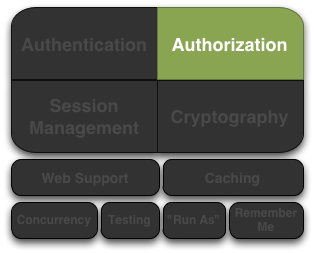
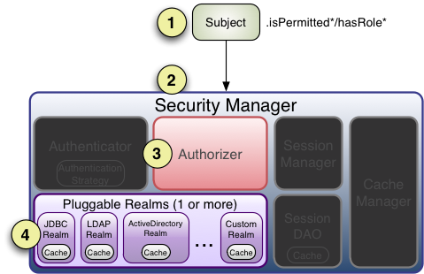

# 6. Authorization 授权

授权，亦即访问控制，是管理资源访问的过程，换言之，也就是控制在一个程序中“谁”有权利访问“什么”。

授权的例子有：是否允许这个用户查看这个页面，编辑数据，看到按钮，或者从这台打印机打印？这些决定是一个用户可以访问什么的决断。

## Authorization 元素

授权有三个核心元素，在 Shiro 中我们经常要用到它们：权限（permissions）、角色（roles）和用户（users）。

### 权限

权限是 Apache Shiro 中安全策略最基本的元素，它们是一组关于行为的基本指令，以显示表示在一个程序中什么可以做。一个很好定义的权限指令必须描述资源以及当一个 Subject 与这些资源交互时什么动作可以执行。
 
下面是一些权限指令的例子：

* 打开一个文件；
* 查看“/user/list”页面；
* 打印文档；
* 删除“Jsmith”用户。

大部分资源都支持基本的 CRUD（create,read,update,delete）操作，但对于特定资源类型，任何动作都是可以的。权限设置最基础的思想是在资源和动作的基础上设置最小量的权限指令。

当看到权限时，最重要的一点是要是认识到一个权限指令不是描述“谁”可以执行这个动作，而是描述“什么”可以做的指令。

*权限只描述行为*

*权限指令只描述行为（和资源相关的动作），并不关心“谁”有能力执行这个动作。*

定义“谁”（用户）被允许做“什么”（权限）需要用一些方法将权限赋给用户，这通常取决于程序的数据模型而且经常在程序中发生改变。

例如，一组权限可以归于一个角色而角色与一个或多个用户对象关联，或者一些程序可以有一组用户而一个组可以指定一个角色，在这里关系将被传递也就是说组内用户隐含被赋予角色的权限。

有很多方式可以将权限赋予用户--程序根据需求决定如何设计。

我们稍后讨论 Shiro 如何判断一个 Subject 是否被允许。

#### 权限粒度

上面的权限示例都是针对资源（门、文件、客户等）指定的动作（打开、读、删除等），在一些场景中，他们也会指定非常细粒度的“实例级别”行为--例如,“删除”（delete）名为“Jsmith”（实例标识）的“用户”（资源类型），在 Shiro 中，你可以精确定义指令到你所能细化到的程度。

我们在 Shiro 的 [Permissions](6.1. Permissions 权限.md) 文档中详细讨论权限粒度和权限指令的“级别”。

### 角色

角色是一个实体名，代表一组行为或职责，这些行为在程序中转换为你可以或者不能做的事情。角色通常赋给用户帐号，关联后，用户就可以“做”属于不同角色的事情。

有两种有效的角色指定方式，Shiro 都支持。 

* 权限隐含于角色中：大部分用户将权限隐含于创建的角色中：程序只是在一个角色名称上隐含了一组行为（也就是权限），使用时，在软件级别不会说“某角色允许执行行为A、B和C”，而是将行为隐含于一个单独的角色名字中。

*潜在的安全隐患*

*虽然这是一个非常简单和常用的方法，但隐含的角色可能会增加软件的维护成本和管理问题。*

*例如，如果你想增加或删除一个角色，或者重定义角色的行为怎么办？你不得不重新打开代码，修改所有对更改后的角色的检测，每次都需要这样做，这还没提到其引起的执行代价（重测试，通过质量验证，关闭程序，升级软件，重启程序等）。*

*对于简单程序这种方法可能适用（比如只有一个'admin'角色和'everyone else'角色），但复杂的程序中，这会成为你程序生命周期中一个主要的问题，会给你的软件带来很大的维护代价。*

* 显示为角色指定权限：显示为角色指定权限本质上是一组权限指令的名称集，在这种形式下，程序（以及 Shiro）准确知道一个特定的角色是什么意思，因为它确切知道某行为是否可以执行，而不用去猜测特定的角色可以或不可以做什么。

Shiro 团队提倡使用权限和显示为角色指定权限替代原始的将权限隐含于角色中的方法，这样你可以对程序安全提供更强的控制。

*基于资源的访问控制*

*读一下这个文章：[新的RBAC：基于资源的权限管理(Resource-Based Access Control)](http://www.waylau.com/new-rbac-resource-based-access-control/)，这篇文章深入讨论了使用权限和显示为角色指定权限代替旧的将权限隐含于角色中方法的好处（以及对源代码的影响）。*

### 用户

一个用户本质上是程序中的“谁”，如同我们前面提到的，Subject 实际上是 shiro 的“用户”。

用户（Subjects）通过与角色或权限关联确定是否被允许执行程序内特定的动作，程序数据模型确切定义了 Subject 是否允许做什么事情。

例如，在你的数据模型中，你定义了一个普通的用户类并且直接为其设置了权限，或者你只是直接给角色设置了权限，然后将用户与该角色关联，通过这种关联，用户就“有”了角色所具备的权限，或者你也可以通过“组”的概念完成这件事，这取决于你程序的设计。

数据模型定义了如何进行授权，Shiro 依赖一个 [Realm](7. Realms.md) 实现将你的数据模型关联转换成 Shiro 可以理解的内容，我们将稍后讨论 Realms。

*最终，是 [Realm](7. Realms.md)  与你的数据源（RDBMS,LDAP等）做交流，Realm 用来告知Shiro 是否角色或权限是否存在，你可以完全控制你的授权模型如何创建和定义。*

## 授权对象

在 Shiro 中执行授权可以有三种途径：

* 程序代码--你可以在你的 JAVA 代码中执行用类似于 if 和 else 的结构来执行权限检查。
* JDK 注解--你可以在你的 JAVA 方法上附加权限注解
* JSP/GSP 标签--你可以基于角色和权限控制 JSP 或 GSP 页面输出内容。

 
### 编程方式授权

直接在程序中为当前 Subject 实例检查授权可能是最简单也最常用的方法。

#### 基于角色的授权

如果你要基于简单/传统的角色名进行访问控制，你可以执行角色检查：

##### 角色检查

如果你想简单地检查一下当前Subject是否拥有一个角色，你可以在一个实例上调用 hasRole* 方法。

例如，查看一个 Subject 是否有特定（单独）的角色，你可以调用subject.[hasRole(roleName)](http://shiro.apache.org/static/current/apidocs/org/apache/shiro/subject/Subject.html#hasRole(java.lang.String))方法，做出相应的反馈。

	Subject currentUser = SecurityUtils.getSubject();
	
	if (currentUser.hasRole("administrator")) {
	    //显示 admin 按钮
	} else {
	    //不显示按钮?  灰色吗？
	}

下面是你可以根据需要调用的函数：

<table >
<tbody>
<tr>
<th colspan="1" rowspan="1" style="white-space: nowrap;"> Subject 方法 </th>
<th colspan="1" rowspan="1" style="cursor: pointer;"> 描述 </th>
</tr>
<tr bgcolor="">
<td colspan="1" rowspan="1"style="white-space: nowrap;"> <tt><a href="static/current/apidocs/org/apache/shiro/subject/Subject.html#hasRole(java.lang.String)">hasRole(String roleName)</a>
</tt> </td>
<td colspan="1" rowspan="1"> 如果Subject指定了特定的角色返回真，否则返回假； </td></tr>
<tr bgcolor="">
<td colspan="1" rowspan="1" style="white-space: nowrap;"> <tt><a href="static/current/apidocs/org/apache/shiro/subject/Subject.html#hasRoles(java.util.List)">hasRoles(List&lt;String&gt; roleNames)</a></tt> </td>
<td colspan="1" rowspan="1" > 返回一个与参数顺序相对应的hasRole结果数组，当一次有多个角色需要检测时非常有用（如定制一个复杂的视图）</td></tr>
<tr bgcolor=""><td colspan="1" rowspan="1" style="white-space: nowrap;"> <tt><a href="static/current/apidocs/org/apache/shiro/subject/Subject.html#hasAllRoles(java.util.Collection)">hasAllRoles(Collection&lt;String&gt; roleNames)</a></tt> </td>
<td colspan="1" rowspan="1" > 如果Subject具备所有角色返回真，否则返回假。</td>
</tr>
</tbody>
</table>

##### 角色判断

还有另一个方法检测 Subjet 是否是指定为某个角色，你可以在的代码执行之前简单判断他们是否是所要求的角色，如果 Subject 不是所要求的角色， [AuthorizationException](http://shiro.apache.org/static/current/apidocs/org/apache/shiro/authz/AuthorizationException.html) 异常将被抛出，如果是所要求的角色，判断将安静地执行并按期望顺序执行下面的逻辑。

例如：

	Subject currentUser = SecurityUtils.getSubject();
	
	//保证当前用户是一个银行出纳员
	//因此允许开立帐户：
	currentUser.checkRole("bankTeller");
	openBankAccount();

与 hasRole* 方法相比，这种方法的好处在于代码更为清晰，如果当前Subject 不满足所需条件你不需要建立你自己的AuthorizationExceptions 异常（如果你不想那么做）。

下面是你可以根据需要调用的函数：

<table >
<tbody>
<tr>
<th colspan="1" rowspan="1" style="white-space: nowrap;"> Subject 方法 </th>
<th colspan="1" rowspan="1" style="cursor: pointer;"> 描述 </th>
</tr>
<tr bgcolor="">
<td colspan="1" rowspan="1"style="white-space: nowrap;"> <tt><a href="http://shiro.apache.org/static/current/apidocs/org/apache/shiro/subject/Subject.html#checkRole(java.lang.String)">checkRole(String roleName)</a>
</tt> </td>
<td colspan="1" rowspan="1"> 如果Subject被指定为特定角色则安静地返回否则抛出AuthorizationException异常；</td></tr>
<tr bgcolor="">
<td colspan="1" rowspan="1" style="white-space: nowrap;"> <tt><a href="http://shiro.apache.org/static/current/apidocs/org/apache/shiro/subject/Subject.html#checkRoles(java.util.Collection)">checkRoles(Collection<String> roleNames)</a></tt> </td>
<td colspan="1" rowspan="1" >如果Subject被指定了所有特定的角色则安静地返回否则抛出AuthorizationException异常；</td></tr>
<tr bgcolor=""><td colspan="1" rowspan="1" style="white-space: nowrap;"> <tt><a href="http://shiro.apache.org/static/current/apidocs/org/apache/shiro/subject/Subject.html#checkRoles(java.lang.String...)">checkRoles(String... roleNames)</a></tt> </td>
<td colspan="1" rowspan="1" > 和上面的checkRoles具有相同的效果，但允许Java5的变参形式。 </td>
</tr>
</tbody>
</table>

#### 基于权限的授权

就像我们上面在角色概述中提到的，通过基于权限的授权执行访问控制是更好的方法。基于权限的授权，因为其与程序功能（以及程序核心资源上的行为）紧密联系，基于权限授权的源代码在程序功能改变时才需要改变，而与安全策略无关。这意味着与同样基于角色的授权相比，对代码的影响更少。

##### 权限检查

如果你希望检查一个 Subject 是否允许做某件事情，你可以调用isPermitted* 方法的变形，有两种主要方式检查授权--基于对象的权限实例和基于字符串的权限表示。

##### 基于对象的权限检查

执行权限检查的一种方法是实例化一个Shiro的[org.apache.shiro.authz.Permission](http://shiro.apache.org/static/current/apidocs/org/apache/shiro/authz/Permission.html)接口并且将它传递给接收权限实例的*isPermitted 方法。

例如，假设一下以下情景：办公室里有一台唯一标识为 laserjet4400n 的打印机，在我们向用户显示打印按钮之前，软件需要检查当前用户是否允许用这台打印机打印文档，检查权限的方式会是这样：

	Permission printPermission = new PrinterPermission("laserjet4400n", "print");
	
	Subject currentUser = SecurityUtils.getSubject();
	
	if (currentUser.isPermitted(printPermission)) {
	    //显示 打印 按钮
	} else {
	    //不显示按钮?  灰色吗？
	}

在这个例子中，我们同样看到了一个非常强大的实例级别的访问控制检查--在单独数据实例上限制行为的能力。

基于对象的权限对下列情况非常有用：

* 希望编译期类型安全；
* 希望确保正确地引用和使用的权限；
* 希望对权限判断逻辑（称作权限隐含逻辑，基于权限接口的 [implies](http://shiro.apache.org/static/current/apidocs/org/apache/shiro/authz/Permission.html#implies(org.apache.shiro.authz.Permission))方法）执行方式进行显示控制；
* 希望确保权限正确地反映程序资源（例如，在一个对象域模型上创建一个对象时，权限类可能自动产生）。

下面是你可以根据需要调用的函数：

<table >
<tbody>
<tr>
<th colspan="1" rowspan="1" style="white-space: nowrap;"> Subject 方法 </th>
<th colspan="1" rowspan="1" style="cursor: pointer;"> 描述 </th>
</tr>
<tr bgcolor="">
<td colspan="1" rowspan="1"style="white-space: nowrap;"> <tt><a href="http://shiro.apache.org/static/current/apidocs/org/apache/shiro/subject/Subject.html#isPermitted(org.apache.shiro.authz.Permission)">isPermitted(Permission p)</a>
</tt> </td>
<td colspan="1" rowspan="1"> 如果Subject允许执行特定权限实例综合指定的动作或资源访问权返回真，否则返回假；</td></tr>
<tr bgcolor="">
<td colspan="1" rowspan="1" style="white-space: nowrap;"> <tt><a href="http://shiro.apache.org/static/current/apidocs/org/apache/shiro/subject/Subject.html#isPermitted(java.util.List)">isPermitted(List<Permission> perms)</a></tt> </td>
<td colspan="1" rowspan="1" >按参数顺序返回isPermitted的结果数组，如果许多权限需要检查时非常有用（如定制一个复杂的视图）</td></tr>
<tr bgcolor=""><td colspan="1" rowspan="1" style="white-space: nowrap;"> <tt><a href="http://shiro.apache.org/static/current/apidocs/org/apache/shiro/subject/Subject.html#isPermittedAll(java.util.Collection))">isPermittedAll(Collection<Permission> perms)</a></tt> </td>
<td colspan="1" rowspan="1" > 如果Subject拥有指定的所有权限返回真，否则返回假。 </td>
</tr>
</tbody>
</table>

##### 基于字符串的权限检查

虽然基于对象的权限检查很有用（编译期类型安全，对行为担保，定制隐含逻辑等），但在许多程序里有时候感觉有点笨重，另一种选择是用普通的字符串来代表权限。

例如，对于上面打印权限的例子，我们可以使用字符串权限检查达到同样的结果

	Subject currentUser = SecurityUtils.getSubject();

	if (currentUser.isPermitted("printer:print:laserjet4400n")) {
	    //显示 打印 按钮
	} else {
	    //不显示按钮?  灰色吗？
	}

这个例子同样实现了实例级别的权限检查，但是所有主要权限部件--printer（资源类型）、print（动作）、laserjet4400n（实例ID）都表现为一个字符串。

上面的例子展示了一种以冒号分割的特殊形式的字符串，定义于Shiro的 [org.apache.shiro.authz.permission.WildcardPermission](http://shiro.apache.org/static/current/apidocs/org/apache/shiro/authz/permission/WildcardPermission.html)中，它适合大多数用户的需求。

上面的代码块基本上是下面这段代码的缩写：
	
	Subject currentUser = SecurityUtils.getSubject();
	
	Permission p = new WildcardPermission("printer:print:laserjet4400n");
	
	if (currentUser.isPermitted(p) {
	    //显示 打印 按钮
	} else {
	    //不显示按钮?  灰色吗？
	}

WildcardPermission 令牌形式和构成选项将在 Shiro 的 [Permission](6.1. Permissions 权限.md)文档中深入讨论
 
上面的字符串使用默认的 WildcardPermission 格式，实际上你可以创造并使用你自己的字符串格式，我们将在下面 Realm 授权章节讨论如何这样做。
 
基于字符串的权限有利的一面在于你不需要实现一个接口而且简单的字符串也非常易读，而不利的一面在于不保证类型安全，而且当你需要定义超出字符串表现能力之外的更复杂的行为时，你仍旧需要利用权限接口实现你自己的权限对象。实际上，大部分 Shiro 的终端用户因为其简单而选择基于字符串的方式，但最终你的程序需求决定了哪一种方法会更好。

和基于对象的权限检查方法一样，下面是字符串权限检查的函数：

<table >
<tbody>
<tr>
<th colspan="1" rowspan="1" style="white-space: nowrap;"> Subject 方法 </th>
<th colspan="1" rowspan="1" style="cursor: pointer;"> 描述 </th>
</tr>
<tr bgcolor="">
<td colspan="1" rowspan="1"style="white-space: nowrap;"> <tt><a href="http://shiro.apache.org/static/current/apidocs/org/apache/shiro/subject/Subject.html#isPermitted(java.lang.String)">isPermitted(String perm)</a>
</tt> </td>
<td colspan="1" rowspan="1">如果Subject被允许执行字符串表达的动作或资源访问权限，返回真，否则返回假；</td></tr>
<tr bgcolor="">
<td colspan="1" rowspan="1" style="white-space: nowrap;"> <tt><a href="http://shiro.apache.org/static/current/apidocs/org/apache/shiro/subject/Subject.html#isPermitted(java.util.List)">isPermitted(String... perms)</a></tt> </td>
<td colspan="1" rowspan="1" >按照参数顺序返回isPermitted的结果数组，当许多字符串权限需要检查时非常有用（如定制一个复杂的视图时）；</td></tr>
<tr bgcolor=""><td colspan="1" rowspan="1" style="white-space: nowrap;"> <tt><a href="http://shiro.apache.org/static/current/apidocs/org/apache/shiro/subject/Subject.html#isPermittedAll(java.lang.String...)">isPermittedAll(String... perms)</a></tt> </td>
<td colspan="1" rowspan="1" > 当Subject具备所有字符串定义的权限时返回真，否则返回假。</td>
</tr>
</tbody>
</table>

#### 权限判断

另一种检查 Subject 是否被允许做某件事的方法是，在逻辑执行之前简单判断他们是否具备所需的权限，如果不允许，[AuthorizationException](http://shiro.apache.org/static/current/apidocs/org/apache/shiro/authz/AuthorizationException.html)异常被抛出，如果是允许的，判断将安静地执行并按期望顺序执行下面的逻辑。

例如：

	Subject currentUser = SecurityUtils.getSubject();
	
	//担保允许当前用户
	//开一个银行帐户：
	Permission p = new AccountPermission("open");
	currentUser.checkPermission(p);
	openBankAccount();

或者，同样的判断，可以用字符串形式：

	Subject currentUser = SecurityUtils.getSubject();
	
	//担保允许当前用户
	//开一个银行帐户：
	currentUser.checkPermission("account:open");
	openBankAccount();

与 isPermitted* 方法相比较，这种方法的优势是代码更为清晰，如果当前Subject 不符合条件，你不必创建你自己的 AuthorizationExceptions 异常（如果你不想那么做）。

下面是你可以根据需要调用的函数：

<table >
<tbody>
<tr>
<th colspan="1" rowspan="1" style="white-space: nowrap;"> Subject 方法 </th>
<th colspan="1" rowspan="1" style="cursor: pointer;"> 描述 </th>
</tr>
<tr bgcolor="">
<td colspan="1" rowspan="1"style="white-space: nowrap;"> <tt><a href="http://shiro.apache.org/static/current/apidocs/org/apache/shiro/subject/Subject.html#checkPermission(org.apache.shiro.authz.Permission)">checkPermission(Permission p)</a>
</tt> </td>
<td colspan="1" rowspan="1">如果Subject被允许执行特定权限实例指定的动作或资源访问，安静地返回，否则抛出AuthorizationException异常。</td></tr>
<tr bgcolor="">
<td colspan="1" rowspan="1" style="white-space: nowrap;"> <tt><a href="http://shiro.apache.org/static/current/apidocs/org/apache/shiro/subject/Subject.html#checkPermission(java.lang.String)">checkPermission(String perm)</a></tt> </td>
<td colspan="1" rowspan="1" >如果Subject被允许执行权限字符串指定的动作或资源访问，安静地返回，否则抛出AuthorizationException异常。</td></tr>
<tr bgcolor=""><td colspan="1" rowspan="1" style="white-space: nowrap;"> <tt><a href="http://shiro.apache.org/static/current/apidocs/org/apache/shiro/subject/Subject.html#checkPermissions(java.util.Collection)">checkPermissions(Collection<Permission> perms)</a></tt> </td>
<td colspan="1" rowspan="1" > 如果Subject被允许执行所有权限实例指定的动作或资源访问，安静地返回，否则抛出AuthorizationException异常。</td>
</tr>
<tr bgcolor=""><td colspan="1" rowspan="1" style="white-space: nowrap;"> <tt><a href="http://shiro.apache.org/static/current/apidocs/org/apache/shiro/subject/Subject.html#checkPermissions(java.lang.String...)">checkPermissions(String... perms)</a></tt> </td>
<td colspan="1" rowspan="1" > 和上面的checkPermissions效果一样，只是使用字符串权限类型。</td>
</tr>
</tbody>
</table>

### 基于注解的授权

如果你更喜欢基于注解的授权控制，除了 Subject 的 API 之外，Shiro提供了一个 Java 5 的注解集。

#### 配置

在你使用 JAVA 的注解之前，你需要在程序中启动 AOP 支持，因为有许多AOP 框架，所以很不幸，在这里并没有标准的在程序中启用 AOP 的方法。

关于AspectJ，你可以查看我们的[AspectJ sample application](http://svn.apache.org/repos/asf/shiro/trunk/samples/aspectj/)；

关于Spring，你可以查看 [Spring Integration](../V. Integration 整合/15. Spring Framework.md)文档；

关于Guice，你可以查看我们的 [Guice Integration](../V. Integration 整合/16. Guice.md)文档；

#### RequiresAuthentication 注解

[RequiresAuthentication](http://shiro.apache.org/static/current/apidocs/org/apache/shiro/authz/annotation/RequiresAuthentication.html) 注解表示在访问或调用被注解的类/实例/方法时，要求 Subject 在当前的 session中已经被验证。

举例：

	@RequiresAuthentication
	public void updateAccount(Account userAccount) {
	    //这个方法只会被调用在
	    //Subject 保证被认证的情况下
	    ...
	}

这基本上与下面的基于对象的逻辑效果相同：

	public void updateAccount(Account userAccount) {
	    if (!SecurityUtils.getSubject().isAuthenticated()) {
	        throw new AuthorizationException(...);
	    }
	    
	    //这里 Subject 保证被认证的情况下
	    ...
	}

#### RequiresGuest 注解

[RequiresGuest](http://shiro.apache.org/static/current/apidocs/org/apache/shiro/authz/annotation/RequiresGuest.html) 注解表示要求当前Subject是一个“guest(访客)”，也就是，在访问或调用被注解的类/实例/方法时，他们没有被认证或者在被前一个Session 记住。

例如：

	@RequiresGuest
	public void signUp(User newUser) {
	    //这个方法只会被调用在
	    //Subject 未知/匿名的情况下
	    ...
	}

这基本上与下面的基于对象的逻辑效果相同：

	public void signUp(User newUser) {
	    Subject currentUser = SecurityUtils.getSubject();
	    PrincipalCollection principals = currentUser.getPrincipals();
	    if (principals != null && !principals.isEmpty()) {
	        //已知的身份 - 不是 guest（访客）:
	        throw new AuthorizationException(...);
	    }
	    
	    //在这里 Subject 确保是一个 'guest（访客）'
	    ...
	}

#### RequiresPermissions 注解

[RequiresPermissions](http://shiro.apache.org/static/current/apidocs/org/apache/shiro/authz/annotation/RequiresPermissions.html) 注解表示要求当前Subject在执行被注解的方法时具备一个或多个对应的权限。

例如：

	@RequiresPermissions("account:create")
	public void createAccount(Account account) {
	    //这个方法只会被调用在
	    //Subject 允许创建一个 account 的情况下
	    ...
	}

这基本上与下面的基于对象的逻辑效果相同

	public void createAccount(Account account) {
	    Subject currentUser = SecurityUtils.getSubject();
	    if (!subject.isPermitted("account:create")) {
	        throw new AuthorizationException(...);
	    }
	    
	    //在这里 Subject 确保是允许
	    ...
	}

#### RequiresRoles  注解

[RequiresRoles](http://shiro.apache.org/static/current/apidocs/org/apache/shiro/authz/annotation/RequiresRoles.html) 注解表示要求当前Subject在执行被注解的方法时具备所有的角色，否则将抛出 AuthorizationException 异常。

例如：

	@RequiresRoles("administrator")
	public void deleteUser(User user) {
	    //这个方法只会被 administrator 调用 
	    ...
	}

这基本上与下面的基于对象的逻辑效果相同

	public void deleteUser(User user) {
	    Subject currentUser = SecurityUtils.getSubject();
	    if (!subject.hasRole("administrator")) {
	        throw new AuthorizationException(...);
	    }
	    
	    //Subject 确保是一个 'administrator'
	    ...
	}

#### RequiresUser 注解

[RequiresUser](http://shiro.apache.org/static/current/apidocs/org/apache/shiro/authz/annotation/RequiresUser.html)* 注解表示要求在访问或调用被注解的类/实例/方法时，当前 Subject 是一个程序用户，“程序用户”是一个已知身份的 Subject，或者在当前 Session 中被验证过或者在以前的 Session 中被记住过。

例如：

	@RequiresUser
	public void updateAccount(Account account) {
	    //这个方法只会被 'user' 调用 
	    //i.e. Subject 是一个已知的身份with a known identity
	    ...
	}

这基本上与下面的基于对象的逻辑效果相同

	public void updateAccount(Account account) {
	    Subject currentUser = SecurityUtils.getSubject();
	    PrincipalCollection principals = currentUser.getPrincipals();
	    if (principals == null || principals.isEmpty()) {
	        //无身份 - 他们是匿名的，不被允许
	        throw new AuthorizationException(...);
	    }
	    
	    //Subject 确保是一个已知的身份
	    ...
	}

### JSP 标签库授权

Shiro 提供了一个标签库来控制 JSP/GSP 页面输出，这将在 [Web](../III. Web Applications/10. Web.md) 文档中的 JSP/GSP 标签库中讨论

## 授权序列

现在我们已经看到如何对当前 Subject 执行授权，让我们了解一下当一个授权命令调用时 Shiro 内部发生了什么事情。

我们仍使用前面Architecture章节里的架构图，在左侧仅仅与授权相关的组件是高亮的，每一个数字代表授权操作中的一个步骤：

**第1步：**程序或框架代码调用一个 Subject 的`hasRole*`、`checkRole*`、 `isPermitted*`或者 `checkPermission*`方法，传递所需的权限或角色。

**第2步：**Subject实例，通常是一个 [DelegatingSubject](http://shiro.apache.org/static/current/apidocs/org/apache/shiro/subject/support/DelegatingSubject.html)（或子类），通过调用securityManager 与各 `hasRole*`、`checkRole*`、 `isPermitted*` 或 `checkPermission*` 基本一致的方法将权限或角色传递给程序的 SecurityManager(实现了 [org.apache.shiro.authz.Authorizer](http://shiro.apache.org/static/current/apidocs/org/apache/shiro/authz/Authorizer.html) 接口)

**第3步：**SecurityManager 作为一个基本的“保护伞”组件,接替/代表其内部 [org.apache.shiro.authz.Authorizer](http://shiro.apache.org/static/current/apidocs/org/apache/shiro/authz/Authorizer.html) 实例通过调用 authorizer 的各自的 `hasRole*`, `checkRole*` , `isPermitted*` ,或 `checkPermission*` 方法。 authorizer 默认情况下是一个实例 [ModularRealmAuthorizer](http://shiro.apache.org/static/current/apidocs/org/apache/shiro/authz/ModularRealmAuthorizer.html) 支持协调一个或多个实例 Realm  在任何授权操作实例。 

**第4步:**，检查每一个被配置的 Realm 是否实现相同的 [Authorizer](http://shiro.apache.org/static/current/apidocs/org/apache/shiro/authz/Authorizer.html)接口，如果是，Realm 自己的各 `hasRole*`、`checkRole*`、 `isPermitted*` 或 `checkPermission*` 方法被调用。

### ModularRealmAuthorizer

前面提到过，Shiro SecurityManager 默认使用 [ModularRealmAuthorizer](http://shiro.apache.org/static/current/apidocs/org/apache/shiro/authz/ModularRealmAuthorizer.html) 实例，ModularRealmAuthorizer 实例同等支持用一个 Realm 的程序和用多个 Realm 的程序。

对于任何授权操作，ModularRealmAuthorizer 将在其内部的 Realm 集中迭代（iterator），按迭代（iteration）顺序同每一个 Realm 交互，与每一个 Realm 交互的方法如下：

1.如果Realm实现了 [Authorizer](http://shiro.apache.org/static/current/apidocs/org/apache/shiro/authz/Authorizer.html) 接口，调用它各自的授权方法（`hasRole*`、 `checkRole*`、`isPermitted*`或 `checkPermission*`）。

1.1.如果 Realm 函数的结果是一个 exception，该 exception 衍生自一个 Subject 调用者的 AuthorizationException，就切断授权过程，剩余的授权 Realm 将不在执行。

1.2.如果 Realm 的方法是一个 `hasRole*` 或 `isPermitted*`，并且返回真，则真值立即被返回而且剩余的 Realm 被短路，这种做法作为一种性能增强，在一个 Realm 判断允许后，隐含认为这个 Subject 被允许。它支持最安全的安全策略：默认情况下所有都被禁止，显示指定允许的事情。

2.如果 Realm 没有实现 Authorizer 接口，将被忽略。

### Realm 授权顺序

需要指出非常重要的一点，就如同验证（authentication）一样，ModularRealmAuthorizer 按迭代（iteration）顺序与 Realm 交互。

ModularRealmAuthorizer 拥有 SecurityManager 配置的 Realm 实例的入口，当执行一个授权操作时，它将在整个集合中进行迭代（iteration），对于每一个实现 Authorizer 接口的 Realm，调用Realm 各自的 Authorizer 方法（如 hasRole*、 checkRole*、 isPermitted*或 checkPermission*）。

### 配置全局的 PermissionResolver

当执行一个基于字符串的权限检查时，大部分 Shiro 默认的 Realm 将会在执行[权限](http://shiro.apache.org/static/current/apidocs/org/apache/shiro/authz/Permission.html)隐含逻辑之前首先把这个字符串转换成一个常用的权限实例。

这是因为权限被认为是基于隐含逻辑而不是相等检查（查看[Permission](https://github.com/waylau/apache-shiro-1.2.x-reference/blob/master/II.%20Core%20%E6%A0%B8%E5%BF%83/6.1.%20Permissions%20%E6%9D%83%E9%99%90.md)章节了解更多隐含与相等的对比）。隐含逻辑用代码表示要比通过字符串对比好，因此，大部分 Realm需要转换一个提交的权限字符串为对应的权限实例。

为了这个转换目的，Shiro 支持 [PermissionResolver](http://shiro.apache.org/static/current/apidocs/org/apache/shiro/authz/permission/PermissionResolver.html)，大部分 Shiro Realm 使用 PermissionResolver 来支持它们对Authorizer 接口中基于字符串权限方法的实现：当这些方法在Realm上被调用时，将使用PermissionResolver 将字符串转换为权限实例，并执行检查。

所有的 Shiro Realm 默认使用内部的 [WildcardPermissionResolver](http://shiro.apache.org/static/current/apidocs/org/apache/shiro/authz/permission/WildcardPermissionResolver.html)，它使用 Shiro 的[WildcardPermission](http://shiro.apache.org/static/current/apidocs/org/apache/shiro/authz/permission/WildcardPermission.html)字符串格式。

如果你想创建你自己的 PermissionResolver 实现，比如说你想创建你自己的权限字符串语法，希望所有配置的Realm实例都支持这个语法，你可以把自己的 PermissionResolver 设置成全局，供所有 realm 使用。

如，在shiro.ini中：

	globalPermissionResolver = com.foo.bar.authz.MyPermissionResolver
	...
	securityManager.authorizer.permissionResolver = $globalPermissionResolver
	...
	 
*PermissionResolverAware*

*如果你想配置一个全局的 PermissionResolver，每一个会读取这个PermissionResolver 配置的 Realm 必须实现[PermissionResolverAware](http://shiro.apache.org/static/current/apidocs/src-html/org/apache/shiro/authz/permission/PermissionResolverAware.html) 接口，这确保被配置 PermissionResolver 的实例可以传递给支持这种配置的每一个 Realm。*

如果你不想使用一个全局的 PermissionResolver 或者你不想被PermissionResolverAware 接口麻烦，你可以显示地为单个的 Realm 配置 PermissionResolver 接口（可看作是JavaBean的setPermissionResolver 方法）：

	permissionResolver = com.foo.bar.authz.MyPermissionResolver
	
	realm = com.foo.bar.realm.MyCustomRealm
	realm.permissionResolver = $permissionResolver
	...

### 配置全局的RolePermissionResolver

与 PermissionResolver 类似，[RolePermissionResolver](http://shiro.apache.org/static/current/apidocs/org/apache/shiro/authz/permission/RolePermissionResolver.html) 有能力表示执行权限检查的 Realm 所需的权限实例。

最主要的不同在于接收的字符串是一个角色名，而不是一个权限字符串。

RolePermissionResolver 被 Realm 在需要时用来转换一个角色名到一组显示的权限实例。

这是非常有用的，它支持那些遗留的或者不灵活的没有权限概念的数据源。

例如，许多 LDAP 目录存储角色名称（或组名）但不支持角色名和权限的联合，因为它没有权限的概念。一个使用 shiro 的程序可以使用存储于 LDAP 的角色名，但需要实现一个 RolePermissionResolver 来转换 LDAP 名到一组确切的权限中以执行显示的访问控制，权限的联合将被存储于其它的数据存储中，比如说本地数据库。

因为这种将角色名转换为权限的概念是特定的，Shiro 默认的 Realm 没有使用它们。 

然而，如果你想创建你自己的 RolePermissionResolver 并且希望用它配置多个 Realm 实现，你可以将你的 RolePermissionResolver设置成全局。

shiro.ini

	globalRolePermissionResolver = com.foo.bar.authz.MyPermissionResolver
	...
	securityManager.authorizer.rolePermissionResolver = $globalRolePermissionResolver
	...

*RolePermissionResolverAware*

*如果你想配置一个全局的 RolePermissionResolver, 每个 Realm 接收必须实现了 [RolePermisionResolverAware](http://shiro.apache.org/static/current/apidocs/org/apache/shiro/authz/permission/RolePermissionResolverAware.html) 接口的配置了的 RolePermissionResolver 。这保证了配置全局 RolePermissionResolver 实例可以传递到各个支持这样配置的 Realm 。*

如果你不想使用全局的 RolePermissionResolver 或者你不想麻烦实现 RolePermissionResolverAware 接口，你可以单独为一个 Realm 配置 RolePermissionResolver（可以看作 JavaBean 的 setRolePermissionResolver 方法）。

	rolePermissionResolver = com.foo.bar.authz.MyRolePermissionResolver

	realm = com.foo.bar.realm.MyCustomRealm
	realm.rolePermissionResolver = $rolePermissionResolver
	...

### 定制Authorizer

如果你的程序使用多于一个 Realm 来执行授权而 ModularRealmAuthorizer 默认的简单迭代（iteration）、短路授权的行为不能满足你的需求，你可以创建自己的 Authorizer 并配置给相应的 SecurityManager。

例如，在shiro.ini中：

	[main]
	...
	authorizer = com.foo.bar.authz.CustomAuthorizer
	
	securityManager.authorizer = $authorizer